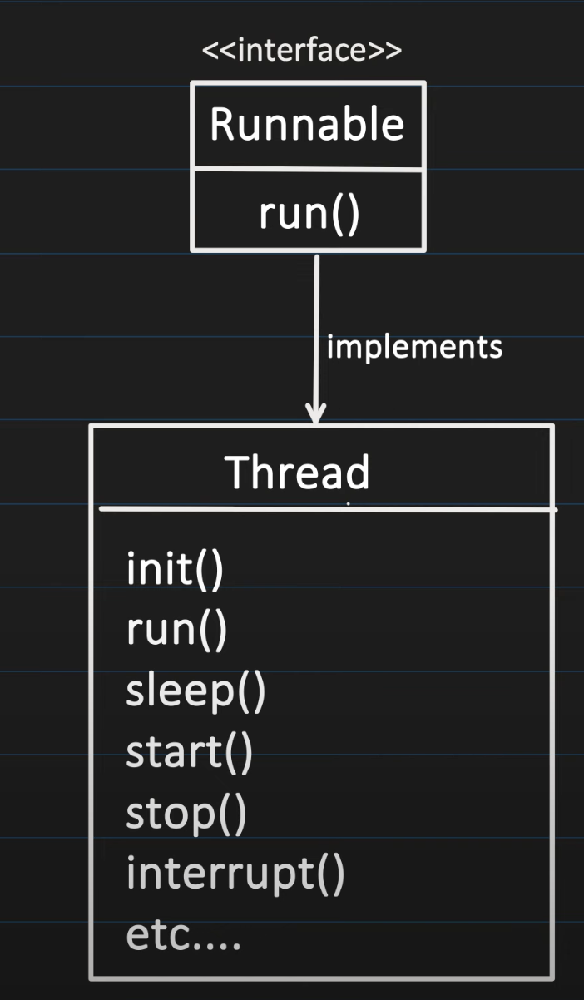
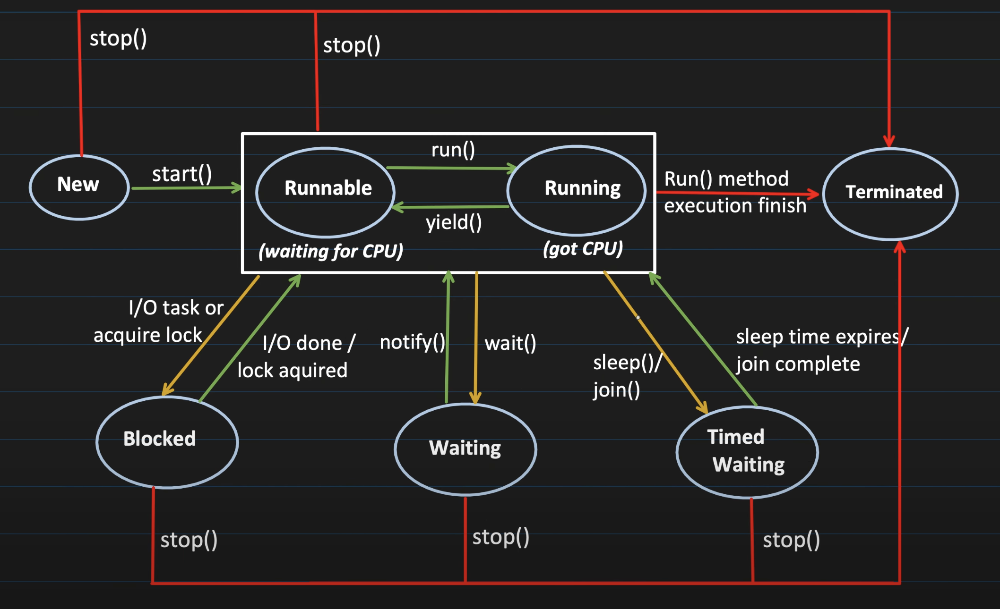

# Multithreading

## Process
- Process is an instance of the program that is getting executed
- It has its own resources like memory, thread, etc.
- OS allocates these resources to process when it gets executed

Lets say, You have a java file Test.java, the steps for execution involves:
- Compilation(javac Test.java): generates bytecode that can be executed using JVM
- Execution(java Test): at this point, JVM starts the new Process (here Test class has psvm method)
- JVM creates a process, the process requires memory as well, it has its own heap memory
- Two prcess don't share resources each other and can execute parallely

## Threads
- Thread is known as light weight process
  OR
- Smallest sequence of instructions that are executed by CPU independently
- 1 process can have multiple threads
- When a process is created, it starts with 1 thread and that initial thread is known as 'main thread' and from that we can create multiple threads to perform tasks concurrenlty

## More about process and threads
- a jvm has a stack memory, and a heap memory 
- but if we go a bit in depth, JVM has heap, stack, code segment, Data segment, registers, Program Counter and others
-  So when we are executing a program
  - Step 1: It will create a process
  - A new JVM instance is created which includes all the memories assigned as discussed above

## How much memory does process get?
While creating the process "java MainClass" command, a new JVM instance will get created and we can tell how much heap memory needs to be allocated

`java -Xms256m -Xmx2g MainClass`

=> -xms<size> -> This will set the initial heap size, above 256MB is allocated
=> -xmx<size> -> This will set the maximum heap size process can get, above 2GB is allocated.  If it tries to allocate more memory then "OutOfMemory" error will occur.

## Threads
- Register, Stack, Counter -> They are locally allocated to each thread, threads don't share these with each other
- Code Segments and Data Segments are being shared between all threads
- heap memory is being shared between all threads

## Code Segment
- It contains the compiled bytecode(machine code) of the java program
- it's read only
- all threads within the same process shares the code segment

## Data segment
- Contains the global and static variables
- All threads within the same process shares teh data segment
- threads can read and modify the same data
- Synchronization is required between multiple threads

## Heap
- objects created at runtime using the "new" keyword are allocated in the heap
- Heap is shared among all the threads of the same process(but not within the process)
- threads can read and modify the heap data 
- Synchronization is required between multiple threads

## Stack
- each thread has its own stack
- it manages method calls, local variables

## Register
- JIT compiler compiles and converts the bytecode into machine code, it uses register to optimise the generated machine code
- also helps in context switching
- each thread has its own register

## Counter
- Also known as program counter, it points to the instruction which is getting executed
- increments its counter after successfull execution of the instruction

All these are managed by JVM

## Multithreading
- allows a program to perform multiple operations at the same time
- multiple threads share the same resource such as memory space but still can perform task independently

## Benefits of MultiThreading
- Improved performance by task parallelism
- Responsiveness
- Resource sharing

## Challenges of MultiThreading
- Concurrency issues like deadlock, data inconsistencies
- Synchronised overhead
- Testing and debugging is difficult

## Multitasking vs Multithreading
- process 1 and process 2 is multitasking
- and inside a task we can create multiple threads to achieve it, it is called as multithreading

# Ways to Create Threads
There are two ways to create a thread
- implementing Runnable interface
- extending Thread class

Why two methods? 
=> We can extend only one parent but if you have interface you can implement as many as you want

runnable is a functional interface, that means only one abstract method

Thread class actually implements runnable, it has all tye methods
- init()
- run()
- sleep()
- start()
- stop()
- interrupt()
etc...

## implementing runnable interface

Step 1:
- create a class that implements Runnable interface
- implement the run() method to tell the task which thread has to do

=> Check <a href="MTLearning.java">MTLearning.java</a>

Step 2:
- create an instance of class that implements Runnable
- Pass the runnable object to the thread constructor
- start the thread

=> check <a href="Main.java">Main.java</a>

The start method internally calls the run method, inside the thread, the run method will get invoked

## extending thread class
Step 1: Create a thread subclass
- create a class that extends 'Thread' class
- Override the 'run' method to tell the task which thread has to do

Step 2: Initiate and start the thread
- Create an instance of the subclass
- Call the start() method to begin the execution

# Thread Lifecycle

**New** 
- Thread has been created but not started
- It is an object in memory

**Runnable** 
- Thread is ready to run
- waiting for cpu time

**Running** 
- When thread starts running its code
- Puts the `MONITOR_LOCKS`

**Blocked** 
- Different scenarios where runnable thread goes into the blocked state
  - I/O: reading from file or database
  - Lock acquired: if thread want to lock on resource which is acquired by another thread, it has to wait
- Whenever thread is blocked, it releases all `MONITOR_LOCKS`

**Waiting** 
- Thread goes into this state when we call `wait()` method, makes it non runnable
- It goes back to runnable, once we call `notify()` or `notifyAll()` method
- Releases all `MONITOR_LOCKS`

**Timed Waitinf** 
- Thread waits for specific period of time and then comesback to runnable state, after certaine conditions are met. like `sleep()`, `join()`
- doesn't release any `MONITOR_LOCKS`

**Terminated** 
- Life of thread is completed, and it cannot be started back again.

## MONITOR LOCK:
- It helps to make sure only 1 thread goes inside the particular section of code(a synchronised block or method).

## Assignment(Producer Consumer Problem)
Two threads, a producer and a consumer share a common fixed size buffer as a queue 
The producer job is to generate data and put it into the buffer, while the consumer's job is to consume the data from the buffer 
The problem is to make sure that the producer won't produce data if the buffer is full and the consumer won't consume the data if buffer is empty
- <a href="producer_consumer/buffer/Main.java">Main.java</a>
- <a href="producer_consumer/buffer/SharedResource.java">SharedResources.java</a>

### Why Stop, Resume, Suspend method is deprecated?

- STOP: Terminates the thread abruptly, no lock release, no resource clean up happens
- SUSPEND: Put the thread on hold(suspend) for temporarily, no lock is released too.
- RESUME: Used to resume teh execution of suspended thread

Both the operation could led to issues like deadlock

## Thread joining
- When join method is invoked on a thread object. Current thread will be blocked and waits for the specific thread to finish.
- It is helpful when we want to coordinate between threads or to ensure we complete certain task efore moving ehead
- <a href="ThreadJoining.java">ThreadJoining.java</a>

## Thread Priority
- Priority Ranges from 1 to 10
  - Priority 1 => low priority
  - Priority 10 => high priority
- Even we set the thread priority whilc creation it's not guaranteed to follow any specific order, it's just a hint to thread scheduler which to execute next.(but it's not strict rule)
- When a new thread is created it inherits the priority from it's parent thread
- <a href="ThreadPriority.java">ThreadPriority.java</a>

## Daemon Thread
- Daemon -> something which is running in async manner(behinf)
- Two types of thread:
  - User thread(this is what we have been creating so far)
  - Daemon Thread(to create we need to call setDaemon and pass true)
- Suppose you have a main thread(user thread) and thread t1(daemon) as soon as main thread finishes the daemon thread will finish its work as well.
- Daemon thread is alive till any one user thread is alive
- <a href="DaemonThread.java">DaemonThread.java</a>
- DaemonThread is helpful for example in java garbage collector is daemon, autosave, logging

## Locks and semaphores
if there are two objects of a synchronised shared resources and thread1 executes using object1 and thread2 uses object2, both enters the critical section because lock is acquired on different objects. That's why both the threads will acquire the lock, but if you have a requirement that, no matter same or different object, 1 thread should go inside the critical section, that brings us to custom lock.

### 4 types of custom locks:
- Reentrant
- Read-Write
- Semaphore
- Stamped

These locks doesn't depend on objects like synchronised methods

#### Reentrant lock
<a href="types_lock/reentrant/SharedResource.java">Reentrant Lock</a>

#### Read-Write lock
- Shared Lock(Read)
- Exclusive Lock

| T1/T2 | S(T1) | X(T1) |
| ----- | ----- | ----- |
| S(T2) | T1&T2 | T1&!T2 |
| X(T2) | T1&!T2 | T1&!T2|

- if a shared lock, other thread can take shared lock as well
- If an exclusive thread is taken by any thread, no other thread can acquire exclusive lock
- if a shared lock is taken by any thread, no other thread can put exclusive lock
- if an exclusive lock is taken by any thread, no other thread can take exclusive lock

#### Stamped Lock
- read write lock's capability
- optimistic read

=> pessimistic lock  
Shared Lock, Exclusive Lock

=> Optimistic Lock 
No Lock acquired, keeps a version associated which gets updated when a value is updated