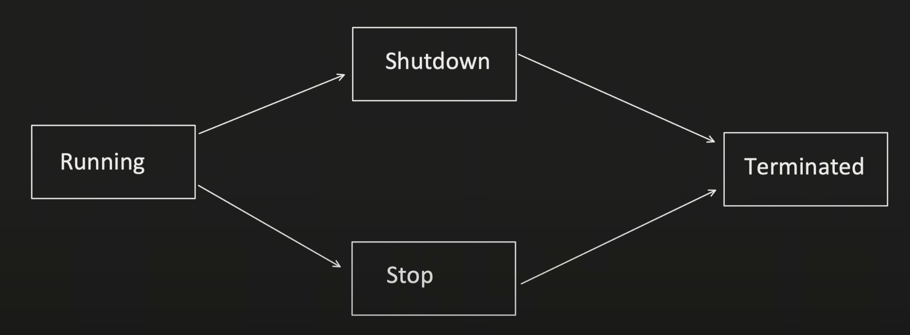

# Thread Pool

## What is Thread Pool?
- It's collection of threads(aka workers) which are available to perform the submitted tasks
- Once task is completed, worker thread gets back to the thread pool and wait for new task to be assigned.
- Threads can be reused

## Advantage of Thread Pool
- Thread creation time can be saved
    - When each thread is created, space is allocated to it(stack, heap, program counter etc.) and this takes time
    - With thread pool, this can be avoided by reusing the thread
- Overhead of managing the thread lifecycle can be removed
    - Thread has different state like Running, Waiting, Terminate, etc. and managing thread state includes complexity
    - Thread Pool abstracts away this management
- Increases the performance
    - More thread means, more context switching time, using control over thread creation, excess context switching can be avoided.

## Java Package
package java.util.concurrent;
- Executor<\<interface>> (execute)
    - Executor Service<\<interface>>(more functionalities)
        - ThreadPoolExecutor
        - ForkJoinPool
        - ScheduledExecutorService<\<interface>>
            - ScheduledThreadPoolExecutor

## ThreadPoolExecutor
It helps to create a customizable ThreadPool

Flow:<br>
Let's say minimum threads defined is 3 threads and they are assigned to a task 1, 2, 3 and now some more tasks comes and they are pushed to queue and at some point the queue gets full and another tasks comes in, what do we do?

Max Thread comes to place so it will increase the threads and assign task that came to that thread. Now if more tasks come and we have utilised the max thread as well, then we have to reject the task

```
public ThreadPoolExecutor(int corePoolSize,
                          int maximumPoolSize,
                          long keepAliveTime,
                          TimeUnit unit,
                          BlockingQueue<Runnable> workQueue,
                          ThreadFactory threadFactory,
                          RejectedExecutionHandler handler)
```
- corePoolSize:
    Number of threads that are initially created and keep in the ppol even if they are idle
- allowCoreThreadTimeout(property):
    If this property is set to true(by default it is false), idle thread kept alive till time specified by 'KeepAliveTime'
- keepAliveTime:
    Thread which are idle gets terminated after this time
- TimeUnit:
    TimeUnit for the keepAliveTime, whether millisecond or second or hours etc.
- maxPoolSize:
    Maximum number of thread pool allowed in a pool
    If no. of thread are == corePoolSize and queue is also full, then new threads are created(till its less than 'maxPoolSize").<br>
    Excess thread, will remain in pool, this pool is not shutdown or if allowCoreThreadTimeOut set to true, then excess thread get terminated after remain idle for KeepAlive Time.
- BlockingQueue: Queue used to hold task, before they get up by the worker thread
    - Bounded Queue: Queue with fixed capacity like ArrayBlockingQueue
    - Unbounded Queue: Queue with no fixed capacity like LinkedBlockingQueue

    BoundedQueue is mostly prefered because it gives more control
- ThreadFactory:
    Factory for creating new thread. ThreadPoolExecutor use this to create new thread, this factory provides us interface to:
    - To give custom thread name
    - To give custom thread priority
    - To set Thread daemon flag etc.
- RejectedExecutionHandler:
    Handler for tasks that cannot be accepted by the thread pool. Generally logging logic can be put for debugging purpose.
    - new ThreadPoolExecutor.AbortPolicy: Throws RejectedExecutionException
    - new ThreadPoolExecutor.CallerRunsPolicy: - Executed the rejected task in the caller thread (thread that attempted to submit the task)
    - new ThreadPoolExecutor.DiscardPolicy: Silently discard the Rejected task, without throwing any exception.
    - new ThreadPoolExecutor.DiscardOldestPolicy: Discard the oldest task in the queue, to accommodate new task.

## Lifecycle of ThreadPoolExecutor


### Running
Executor is in running state and submit() method will be used to add new task.

### Shutdown
- Executor do not accept new tasks but continue to process existing tasks, once existing task is finished, executor moves to terminate state.

### Stop(force shutdown)
- method: shutdownNow()
- Executor do not accept new tasks.
- Executor forcefully stops all the tasks which are currently executing.
- And once fully shutdown, moves to terminate state.
- Method used shutdownNow()

### Terminated
- End of life for particular ThreadPoolExecutor
- isTerminated() method can be used to check if particular thread pool executor is terminated or not

## Implementation
Create a thread pool with following requirements
- min threads = 2
- max threads = 4
- queue size = 2

UseCase 1 will have 4 tasks<br>
UseCase 2 will have 5 tasks<br>
UseCase 3 will have 8 tasks<br>

<a href="ThreadPool.java">ThreadPool.java</a>

## Interview Question
In ThreadPool, why have you taken corePoolSize as 2, why not 10 or 15 or another number, what's the logic?

Generally, the ThreadPool min and max size are depend on various factors like:
- CPU Cores
    - If there are 2 cpu cores and 100 threads, most of the time they will do context switching
- JVM Memory
    - Threads are allocated this memory and JVM might have very limited memory so 100 threads cannot be allocated
- Task Nature (CPU Intensive or I/O Intensive)
    - If CPU Intensive task is there, less thread should be kept
    - If I/O Intensive task is there, more thread should be kept(I/O will keep thread idle, so CPU should pick another thread)
- Concurrency Requirement (Want high or medium or low concurrency)
- Memory Required to process a request
- Throughput etc.

And its an iterative process to update the min and max values based on monitoring.

## Formula to find number of thread
(not full proved)<br>
max number of thread = No .of CPU Core * ( 1 + Request Waiting Time / Processing Time )<br>
No. of CPU Core = 64<br>
Request Waiting Time = 50ms<br>
Processing Time = 100ms<br>

If it is CPU intensive Request Waiting Time will be less and Processing Time will be more.<br>
If it is CPU intensive Request Waiting Time will be more and Processing Time will be less.<br>


max number of thread = 64 * ( 1 + 50/100 ) ~= 64<br>

max number of active tasks = Task arrival ate * Task Execution time<br>
64 / 0.15 ~= 426apx task arrival rate per second can be handled 

But this doesn't consider memory as factor

JVM: 2GB<br>
(<br>
    Heap Space: 1GB<br>
    Code Cache Space: 128MB<br>
    JVM Overhead: 256MB<br>
    per thread space: 5MB * (N no. of threads (includes Thread stack space))<br>
)

1000 + 128 + 256 + x = 2000<br>
x = 616

Lets say 1 thread takes 5MB (Stack, Register, PC), so how many threads can we create?<br>
616 / 5 = 123

We cannot consume the whole space so we need to keep a buffer, let's say 60% of heap space => 600 MB so that will eventually lead to 60% of the threads = 0.6 * 123 = 73

So Min = 60<br>
Max = 70<br>

Then I have to do monitoring and check if this number is fine